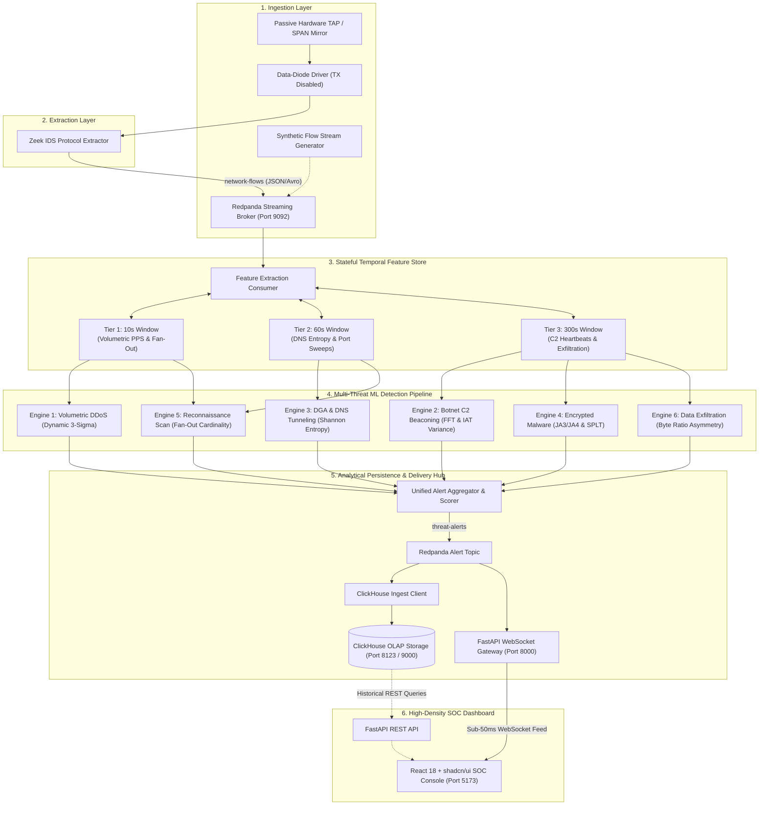

# ThreatLens: Real-Time Passive Network Threat Detection & Live Forensic Intelligence

[](https://www.python.org/)
[](https://fastapi.tiangolo.com/)
[](https://react.dev/)
[](https://www.typescriptlang.org/)
[](https://tailwindcss.com/)
[](https://ui.shadcn.com/)
[](https://redis.io/)
[](https://clickhouse.com/)
[](https://redpanda.com/)
[](https://www.docker.com/)
[](LICENSE)

ThreatLens is an enterprise-grade, read-only passive network threat detection and forensic intelligence platform. Designed for high-throughput packet metadata inspection, sliding-window anomaly detection, and dense Security Operations Center (SOC) visualization, ThreatLens enables line-rate visibility into hostile enterprise network flows without decrypting payloads or causing inline backpressure.

---

## 1. System Architecture Overview

ThreatLens implements a decoupled, event-driven streaming architecture across six functional pipeline layers:



---

## 2. Core Architectural Pillars

### A. Zero-Transmit Passive Ingestion
To eliminate the risk of operational disruption, transmission leakage, or discovery by adversaries, the sensor platform enforces data-diode ingestion:
- Monitor interfaces run in unaddressed promiscuous mode with all Layer 2 and Layer 3 outbound transmissions disabled (`ip link set <dev> arp off; sysctl -w net.ipv6.conf.<dev>.disable_ipv6=1`).
- ARP, ICMP, DHCP, and IPv6 router solicitations are blocked at the kernel and physical driver levels.
- Non-intrusive protocol parsing: raw packet payloads are purged from memory immediately following header extraction and TLS handshake recording.

### B. Stateful Temporal Memory
Adversaries intentionally bypass static signature firewalls by staging attacks across multi-minute windows. ThreatLens deploys three synchronized sliding windows implemented using Redis sorted sets (`ZADD`, `ZRANGEBYSCORE`, `ZREMRANGEBYSCORE`) with bounded in-memory fallbacks:
- **10-Second Window**: Evaluates high-frequency volumetric spikes, SYN flood concentrations, and immediate destination endpoint fan-out sweeps.
- **60-Second Window**: Tracks domain lexical distributions, DNS resolution bursts, and horizontal port scanning spreads.
- **300-Second Window**: Captures persistent C2 beaconing heartbeats, inter-arrival time distributions, and sustained outbound data exfiltration ratios.
- **Automated Memory Bounds**: Timestamps older than the active horizon are evicted during every write cycle with an automatic TTL safeguard, preventing memory exhaustion.

### C. Non-Decrypted Cryptographic Profiling
ThreatLens enforces zero packet payload decryption, preserving network privacy and cryptographic integrity:
- **Cryptographic Fingerprinting**: Extracts client JA3 and JA4 hashes derived from TLS ClientHello parameters (ciphers, extensions, supported groups, and point formats).
- **Sequence of Packet Lengths and Times (SPLT)**: Captures directional byte lengths and millisecond-precision packet intervals during connection negotiation to classify malicious tools without inspecting payload bytes.

---

## 3. Standardized Alert Contract

All detection modules, stream topics, database tables, and WebSocket payloads adhere to a synchronized contract enforced by Pydantic v2 (`backend/app/schemas.py`) and TypeScript interfaces (`frontend/src/types/threat.ts`):

```json
{
  "timestamp": "2026-09-13T01:00:00.000Z",
  "flow_id": "192.168.1.105:54321->198.51.100.44:8443",
  "threat_class": "Botnet C2 Beaconing",
  "confidence_score": 0.94,
  "evidence": {
    "inter_arrival_variance": 0.0012,
    "shannon_entropy": 3.82,
    "byte_ratio": 0.08,
    "fan_out_count": 1,
    "ja3_hash": "e7d705a3286e19ea42f587b344ee6865",
    "details": "Periodic beaconing detected at 15.0s intervals via FFT harmonic analysis."
  }
}
```

### Contract Properties

| Property | Type | Specification |
| :--- | :--- | :--- |
| `timestamp` | `datetime` (ISO 8601 UTC) | Exact UTC timestamp of threat evaluation. |
| `flow_id` | `string` | Canonical flow identifier in format: `src_ip:src_port->dst_ip:dst_port`. |
| `threat_class` | `ThreatClassEnum` | Standardized categorization across the 6 supported threat vectors. |
| `confidence_score` | `float` ($0.00 \le c \le 1.00$) | Probability and heuristic confidence index. |
| `evidence.inter_arrival_variance` | `float` | Population variance of packet inter-arrival times ($\Delta t$) in seconds squared. |
| `evidence.shannon_entropy` | `float` | Character-level Shannon entropy in bits ($0.0 \le H \le 8.0$). |
| `evidence.byte_ratio` | `float` | Outbound egress bytes divided by inbound ingress bytes. |
| `evidence.fan_out_count` | `integer` | Count of unique external IP addresses or ports contacted in the window. |
| `evidence.ja3_hash` | `string` (Nullable) | 32-character MD5 cryptographic hash of TLS ClientHello parameters. |
| `evidence.details` | `string` | Human-readable forensic summary and heuristic rationale. |

---

## 4. Detection Engines Matrix

| Threat Class | Detection Methodology | Mathematical Formulation | Window Tier | Operational Trigger |
| :--- | :--- | :--- | :--- | :--- |
| **Volumetric & Protocol DDoS** | Statistical 3-Sigma Surge & SYN/UDP Ratio | $Z = \frac{\text{PPS} - \mu}{\sigma} > 3.0$ | 10 Seconds | $\text{PPS} > 1,000$, $\text{SYN Ratio} > 0.85$, or UDP storm exceeding 3.0 standard deviations. |
| **Botnet C2 Beaconing** | Fast Fourier Transform (FFT) & Low IAT Variance | $\text{Var}(\Delta t) = \frac{1}{N} \sum (\Delta t - \mu)^2$ | 300 Seconds | Automated recurring connections ($\ge 4$ events) with interval variance $\text{Var}(\Delta t) < 0.05\text{ s}^2$. |
| **DGA & DNS Tunneling** | Character Shannon Entropy & FQDN Length Analysis | $H(X) = -\sum P(x) \log_2 P(x)$ | 60 Seconds | Domain query $H(X) \ge 3.80\text{ bits}$, query length $> 60\text{ chars}$, or TXT tunneling. |
| **Encrypted Malware** | Threat Intelligence JA3 Matching & SPLT Profiling | $\text{Score}(\mathbf{x}) = 2^{-\frac{E(h(\mathbf{x}))}{c(n)}}$ | 300 Seconds | Known malicious JA3 hash match (TrickBot, Cobalt Strike, Emotet) or SPLT burst outlier. |
| **Reconnaissance Scan** | Endpoint Cardinality Dispersion & SYN Asymmetry | $C = \vert \mathcal{D} \vert = \text{Card}(\text{Targets})$ | 10s / 60s | Single source IP probing $\ge 15$ distinct ports or external IP addresses with $\le 2$ packets per target. |
| **Data Exfiltration** | Outbound Flow Ratio & High-Volume Egress Z-Score | $R = \frac{\text{Bytes(Egress)}}{\max(\text{Bytes(Ingress)}, 1)}$ | 300 Seconds | Non-server host transmitting $> 5\text{ MB}$ outbound with flow asymmetry ratio $R \ge 50.0$. |

---

## 5. Repository Structure

```
ThreatLens/
├── backend/
│   ├── app/
│   │   ├── __init__.py
│   │   ├── main.py                 # FastAPI application, REST endpoints, WebSocket hub & background stream worker
│   │   ├── schemas.py              # Pydantic v2 schemas: ThreatClassEnum, EvidenceSchema, ThreatAlertSchema
│   │   ├── storage.py              # ClickHouseAlertStore: table initialization, batch insert & memory ring buffer
│   │   └── websocket_manager.py    # ConnectionManager: live client connection tracking & sub-50ms alert broadcast
│   ├── requirements.txt            # Backend dependencies (FastAPI, Redis, ClickHouse, Pydantic, Scikit-learn, httpx)
│   └── tests/
│       ├── __init__.py
│       ├── test_api.py             # FastAPI REST & WebSocket endpoint integration tests (TestClient)
│       ├── test_engines.py         # Multi-model detection engines and pipeline integration tests
│       └── test_features.py        # Statistical metrics, Shannon entropy, and SlidingWindowStore tests
├── engine/
│   ├── __init__.py
│   ├── features/
│   │   ├── __init__.py
│   │   ├── metrics.py              # Shannon entropy, flow ratio, IAT variance, and fan-out calculators
│   │   └── store.py                # SlidingWindowStore: Redis sorted sets (10s, 60s, 300s) with in-memory deque fallback
│   ├── models/
│   │   ├── __init__.py
│   │   ├── aggregator.py           # AlertAggregator: concurrent multi-model dispatch & confidence score normalizer
│   │   ├── base.py                 # BaseDetectionEngine interface & DetectionCandidate dataclass
│   │   ├── beaconing_engine.py     # Botnet C2 beaconing engine (FFT harmonic periodicity & low IAT variance)
│   │   ├── ddos_engine.py          # Volumetric DDoS engine (Dynamic 3-sigma PPS & SYN flood evaluation)
│   │   ├── dns_engine.py           # DGA & DNS tunneling engine (Character Shannon entropy & payload size thresholds)
│   │   ├── exfiltration_engine.py  # Data exfiltration engine (Outbound-to-inbound byte asymmetry Z-scores)
│   │   ├── malware_engine.py       # Encrypted malware engine (JA3 cryptographic fingerprint matching & SPLT heuristics)
│   │   └── recon_engine.py         # Reconnaissance scan engine (Multi-tier endpoint cardinality dispersion)
│   └── pipeline.py                 # DetectionPipeline orchestrator & process_flow_event callable entrypoint
├── frontend/
│   ├── index.html                  # HTML5 template with dark theme and Inter/JetBrains Mono fonts
│   ├── package.json                # React 18, Vite, Tailwind CSS, Recharts, Hugeicons, and class utilities
│   ├── postcss.config.js           # PostCSS Tailwind CSS pipeline
│   ├── tailwind.config.js          # Tailwind CSS theme tokens & dark color configurations
│   ├── tsconfig.json               # TypeScript compiler options & '@/*' path alias
│   ├── tsconfig.node.json          # Vite node configuration
│   ├── vite.config.ts              # Vite dev server with proxy routing for /api and /ws
│   └── src/
│       ├── App.tsx                 # Main SOC Enclave application layout with KPI cards & live data feeds
│       ├── index.css               # Global styles, dark tokens, and customized SOC scrollbars
│       ├── main.tsx                # React DOM root entrypoint
│       ├── components/
│       │   ├── ForensicDrawer.tsx  # Slide-over forensic sheet: telemetry metrics, JA3 copy & raw JSON viewer
│       │   ├── Navbar.tsx          # Brand header: live stream pulse pill, real-time UTC clock & freeze toggle
│       │   ├── ThreatTable.tsx     # High-density alert table: severity badges, progress bars, search & filters
│       │   ├── ThroughputGauge.tsx # Recharts Area chart: real-time flows/sec, packets/sec (PPS) & peak Mbps
│       │   └── ui/                 # Reusable shadcn/ui primitives (badge, button, card, sheet, table, tabs, tooltip)
│       ├── hooks/
│       │   └── useThreatSocket.ts  # Resilient auto-reconnecting WebSocket hook with rolling buffer & pause toggle
│       ├── lib/
│       │   └── utils.ts            # Class merging utility (clsx + tailwind-merge) and formatting helpers
│       └── types/
│           └── threat.ts           # Synchronized TypeScript interfaces matching backend Pydantic schemas
├── ingest/
│   ├── __init__.py
│   ├── producers/
│   │   ├── __init__.py
│   │   └── mock_producer.py        # Synthetic multi-class network flow stream generator and Kafka publisher
│   └── zeek/                       # Passive packet capture configurations & Zeek scripts (Milestone 6)
├── docker-compose.yml              # Multi-service hybrid pipeline (Redpanda, Redpanda Console, Redis, ClickHouse)
├── .env.example                    # Service ports, hostnames, and detection parameters
└── .gitignore                      # Environment secrets, logs, PCAPs, and build artifact exclusions
```

---

## 6. Local Quickstart Guide

### System Prerequisites
- **Python**: Version 3.11 or higher
- **Node.js**: Version 18 or higher (with `npm`)
- **Docker**: Docker Engine and Docker Compose v2+

---

### Step 1: Clone Repository & Configure Environment
```bash
git clone https://github.com/RaKa8904/ThreatLens.git
cd ThreatLens
cp .env.example .env
```

---

### Step 2: Bootstrap Infrastructure Services (Docker)
Start the message broker, in-memory sliding-window store, and analytical OLAP archive:
```bash
docker compose up -d
```

Service access points:
- **Redpanda Broker**: `localhost:9092`
- **Redpanda Web Console**: [http://localhost:8080](http://localhost:8080)
- **Redis Feature Store**: `localhost:6379`
- **ClickHouse HTTP Interface**: [http://localhost:8123/ping](http://localhost:8123/ping)

---

### Step 3: Set Up Backend & Launch FastAPI Gateway
Initialize the Python virtual environment, install dependencies, and launch the Uvicorn server:
```bash
# Initialize virtual environment
python -m venv .venv

# Activate environment:
# On Linux / macOS:
source .venv/bin/activate
# On Windows PowerShell:
.\.venv\Scripts\Activate.ps1

# Install backend dependencies
pip install -r backend/requirements.txt

# Launch FastAPI server (with real-time WebSocket hub & background telemetry generator)
uvicorn backend.app.main:app --reload --port 8000
```

FastAPI endpoints:
- **Interactive OpenAPI Documentation**: [http://localhost:8000/docs](http://localhost:8000/docs)
- **Healthcheck Endpoint**: [http://localhost:8000/api/health](http://localhost:8000/api/health)
- **Historical Alerts Endpoint**: [http://localhost:8000/api/alerts](http://localhost:8000/api/alerts)
- **WebSocket Broadcast Stream**: `ws://localhost:8000/ws/threats`

---

### Step 4: Set Up Frontend & Launch SOC Enclave Dashboard
Open a secondary terminal to launch the React 18 dashboard:
```bash
cd frontend
npm install
npm run dev
```

Open the dashboard in your browser: [http://localhost:5173](http://localhost:5173)

---

### Step 5: Execute Complete Test Suite
Run all 35 statistical, detection engine, pipeline, and API integration tests:
```bash
python -m unittest discover -s backend/tests -v
```

Expected output:
```text
test_get_alerts_unfiltered (test_api.TestFastAPIGateway) ... ok
test_get_alerts_with_threat_class_filter (test_api.TestFastAPIGateway) ... ok
test_health_endpoint (test_api.TestFastAPIGateway) ... ok
test_metrics_throughput_endpoint (test_api.TestFastAPIGateway) ... ok
test_websocket_threat_stream (test_api.TestFastAPIGateway) ... ok
test_async_process_flow_event (test_engines.TestPipelineAndAggregator) ... ok
test_benign_traffic_no_false_positives (test_engines.TestPipelineAndAggregator) ... ok
test_pipeline_all_threat_classes_produce_valid_schemas (test_engines.TestPipelineAndAggregator) ... ok
test_pydantic_schema_strict_conformance (test_engines.TestPipelineAndAggregator) ... ok
test_beaconing_engine_detection (test_engines.TestThreatDetectionEngines) ... ok
test_ddos_engine_detection (test_engines.TestThreatDetectionEngines) ... ok
test_dns_engine_detection (test_engines.TestThreatDetectionEngines) ... ok
test_exfiltration_engine_detection (test_engines.TestThreatDetectionEngines) ... ok
test_malware_engine_detection (test_engines.TestThreatDetectionEngines) ... ok
test_recon_engine_detection (test_engines.TestThreatDetectionEngines) ... ok
test_10s_volumetric_and_fanout_metrics (test_features.TestSlidingWindowStore) ... ok
test_300s_c2_and_exfiltration_metrics (test_features.TestSlidingWindowStore) ... ok
test_60s_dns_and_recon_metrics (test_features.TestSlidingWindowStore) ... ok
test_window_retention_and_expiration (test_features.TestSlidingWindowStore) ... ok
test_fan_out_cardinality (test_features.TestStatisticalMetrics) ... ok
test_flow_ratio_negative_guard (test_features.TestStatisticalMetrics) ... ok
test_flow_ratio_normal_and_asymmetric (test_features.TestStatisticalMetrics) ... ok
test_inter_arrival_variance_edge_cases (test_features.TestStatisticalMetrics) ... ok
test_inter_arrival_variance_periodic_vs_random (test_features.TestStatisticalMetrics) ... ok
test_shannon_entropy_diverse_strings (test_features.TestStatisticalMetrics) ... ok
test_shannon_entropy_empty_and_single (test_features.TestStatisticalMetrics) ... ok
test_shannon_entropy_ip_distribution (test_features.TestStatisticalMetrics) ... ok
test_benign_flow_structure (test_features.TestSyntheticFlowGenerator) ... ok
test_botnet_c2_beacon_characteristics (test_features.TestSyntheticFlowGenerator) ... ok
test_data_exfiltration_characteristics (test_features.TestSyntheticFlowGenerator) ... ok
test_dga_dns_tunnel_characteristics (test_features.TestSyntheticFlowGenerator) ... ok
test_encrypted_malware_characteristics (test_features.TestSyntheticFlowGenerator) ... ok
test_mock_event_producer_batch_generation (test_features.TestSyntheticFlowGenerator) ... ok
test_recon_scan_characteristics (test_features.TestSyntheticFlowGenerator) ... ok
test_volumetric_ddos_characteristics (test_features.TestSyntheticFlowGenerator) ... ok
----------------------------------------------------------------------
Ran 35 tests in 0.089s

OK
```

---

## 7. Roadmap & Milestone Status

| Milestone | Phase | Scope & Deliverables | Status |
| :---: | :--- | :--- | :---: |
| **01** | Core Contracts & Docker Stack | Pydantic v2 schemas, synchronized TypeScript types, and multi-service `docker-compose.yml`. | Complete |
| **02** | Feature Store & Synthetic Stream | SlidingWindowStore (10s, 60s, 300s), Shannon entropy, IAT variance, and synthetic generator. | Complete |
| **03** | Multi-Threat ML Detection Pipeline | 6 specialized detection engines, FFT periodicity, dynamic 3-sigma scoring, and AlertAggregator. | Complete |
| **04** | Streaming Gateway & Persistence | ClickHouse columnar storage client, FastAPI REST API, and sub-50ms WebSocket broadcast hub. | Complete |
| **05** | High-Density SOC Dashboard | React 18 dashboard with shadcn/ui, Hugeicons, Recharts, slide-over ForensicDrawer, and freeze toggle. | Complete |
| **06** | Hardware TAP & Live PCAP Replay | Containerized Zeek sensor scripts, optical TAP interface bindings, and live PCAP replay ingestion. | Next |

---

## License

This project is licensed under the Apache License 2.0. See the [LICENSE](LICENSE) file for details.
