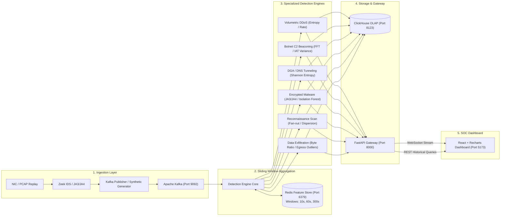

# ThreatLens 🔍⚡

**ThreatLens** is a production-ready, read-only network threat detection platform designed for real-time security telemetry analysis, sliding-window anomaly detection, and high-density SOC visualization.

---

## 🏛️ System Architecture

ThreatLens follows an event-driven streaming pipeline designed for high-throughput packet metadata inspection and low-latency alert dissemination:



---

## 📂 Repository Map

```
ThreatLens/
├── ingest/            # Zeek capture configs, JA3/JA4 extractors, Kafka publishers & synthetic mocks
├── engine/            # Stateful sliding windows (10s, 60s, 300s), Shannon entropy, FFT, ML inference
├── backend/           # FastAPI WebSocket broadcaster, ClickHouse query endpoints, Pydantic schemas
├── frontend/          # React SPA with Tailwind CSS, Recharts for analytics, Lucide icons
├── .env.example       # Default port and service environment declarations
└── .gitignore         # Build artifacts, logs, PCAPs, and environment secret exclusions
```

---

## 🛡️ Standardized Alert Schema

Every alert produced by the detection engines, stored in ClickHouse, relayed by FastAPI, and rendered on the dashboard conforms to the following strict specification:

```json
{
  "timestamp": "2026-09-12T01:00:00.000Z",
  "flow_id": "192.168.1.105:54321->10.0.0.1:443",
  "threat_class": "Botnet C2 Beaconing",
  "confidence_score": 0.94,
  "evidence": {
    "inter_arrival_variance": 0.0012,
    "shannon_entropy": 3.82,
    "byte_ratio": 0.08,
    "fan_out_count": 1,
    "ja3_hash": "e7d705a3286e19ea42f587b344ee6865",
    "details": "Periodic beaconing detected at 15.0s intervals via FFT harmonic analysis."
  }
}
```

### Supported Threat Classes
| Threat Class | Detection Methodology & Features |
| :--- | :--- |
| **Volumetric DDoS** | Sudden spikes in flow PPS/BPS, low Shannon entropy of target space, high byte ratios. |
| **Botnet C2 Beaconing** | Fast Fourier Transform (FFT) dominant peak detection, ultra-low inter-arrival time (IAT) variance. |
| **DGA / DNS Tunneling** | High Shannon entropy on domain query names, TXT record size anomalies, query frequency bursts. |
| **Encrypted Malware** | JA3/JA4 fingerprint matching, TLS record size distribution, Isolation Forest anomaly scoring. |
| **Reconnaissance Scan** | High destination IP/port fan-out count, abnormal SYN/ACK ratios, low payload transfer. |
| **Data Exfiltration** | Asymmetric high egress-to-ingress byte ratios, anomalous continuous connection durations. |

---

## ⚙️ Service Ports & Default Configuration

Defined in `.env.example`:

| Service | Port | Description |
| :--- | :--- | :--- |
| **Kafka** | `9092` | Network flow metadata streaming & alert message bus |
| **Redis** | `6379` | In-memory sliding-window feature store (10s, 60s, 300s) |
| **ClickHouse** | `8123` (HTTP) / `9000` (Native) | High-throughput columnar OLAP database for alerts and flows |
| **FastAPI** | `8000` | REST API and real-time WebSocket alert broadcaster |
| **Frontend** | `5173` | React + TypeScript + Tailwind CSS SOC console |

---

## 🚀 Execution & Development Roadmap

1. **Phase 1 & 2 (Data Definitions & Pipeline Mocks)**: Pydantic schemas, Zeek/flow models, synthetic traffic generator, Kafka and Redis interfaces.
2. **Phase 3 (Detection Engines & Scoring)**: Shannon entropy calculator, FFT beacon detector, Isolation Forest / XGBoost classifiers, rule evaluators.
3. **Phase 4 (FastAPI Backend & Gateway)**: Streaming WebSocket manager, ClickHouse integration, query API with filtering and aggregation.
4. **Phase 5 (React + Recharts Dashboard)**: High-density dark SOC interface, real-time alert feed, live bandwidth/entropy charts, interactive threat drilldowns.
