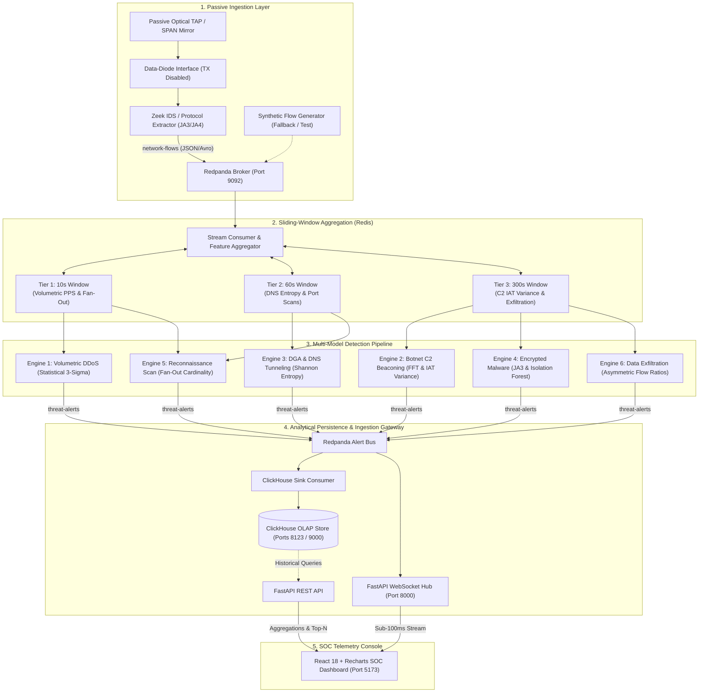

# ThreatLens: Real-Time Passive Network Threat Detection & Forensic Pipeline

[](https://www.python.org/)
[](https://fastapi.tiangolo.com/)
[](https://redis.io/)
[](https://clickhouse.com/)
[](https://www.docker.com/)
[](https://redpanda.com/)
[](LICENSE)

ThreatLens is an enterprise-grade, read-only network threat detection and security analytics platform. Engineered for zero-transmit passive telemetry inspection, sliding-window anomaly detection, and high-density Security Operations Center (SOC) visualization, ThreatLens enables line-rate inspection of live enterprise flows without decrypting traffic or risking inline operational disruption.

---

## 1. System Architecture

ThreatLens employs an asynchronous, decoupled streaming architecture. Network packet metadata flows from passive hardware optical TAPs or switch SPAN mirrors into a dedicated stream broker, traverses a multi-tier sliding-window feature store, undergoes statistical and machine-learning anomaly scoring, and is disseminated via WebSockets and indexed in an analytical OLAP database.



---

## 2. Core Architectural Principles

ThreatLens is constructed around three strict architectural tenets:

### A. Zero-Transmit Passive Ingestion
To eliminate the risk of operational disruption, network backpressure, or detection by adversaries, the sensor node operates in strict data-diode mode:
- Ingress physical interfaces are bound with packet transmission disabled at the kernel and driver layer (`ip link set <dev> arp off; sysctl -w net.ipv6.conf.<dev>.disable_ipv6=1`).
- Telemetry extraction is non-intrusive: packet payloads are discarded immediately following protocol header and TLS handshake parsing.
- Sensor hardware maintains isolation between monitor interfaces and out-of-band management interfaces.

### B. Stateful Rolling Windows
Modern advanced persistent threats (APTs) avoid naive threshold trips by distributing telemetry across long horizons. ThreatLens deploys three synchronized sliding windows implemented using Redis sorted sets (`ZADD`, `ZRANGEBYSCORE`, `ZREMRANGEBYSCORE`) with bounded in-memory fallbacks:
- **10-Second Window**: Captures high-frequency transients, volumetric SYN bursts, and rapid destination fan-out sweeps.
- **60-Second Window**: Tracks DNS resolution bursts, domain lexical distributions, and horizontal subnet probes.
- **300-Second Window**: Isolates low-and-slow C2 heartbeats, inter-arrival time distributions, and sustained outbound exfiltration ratios.
- **Automated Memory Bounds**: Expired timestamps are removed at every write cycle with explicit TTL auto-eviction, preventing unbounded heap inflation.

### C. In-Transit Metadata Analysis
ThreatLens enforces zero payload decryption. Traffic classification relies on encrypted traffic metadata and packet dynamics:
- **Cryptographic Fingerprinting**: Extraction of client JA3 and JA4 hashes derived from TLS ClientHello parameters (ciphers, extensions, elliptic curves, and point formats).
- **Sequence of Packet Lengths and Times (SPLT)**: First-N packet byte lengths and directional inter-arrival times characterize behavioral signatures without breaking transport-layer security.

---

## 3. Standardized Alert Contract

All detection modules, queue topics, database records, and frontend feeds conform to a strict, immutable contract enforced via Pydantic v2 schemas (`backend/app/schemas.py`) and synchronized TypeScript definitions (`frontend/src/types/threat.ts`):

```json
{
  "timestamp": "2026-09-12T01:00:00.000Z",
  "flow_id": "192.168.1.105:54321->198.51.100.44:8443",
  "threat_class": "Botnet C2 Beaconing",
  "confidence_score": 0.94,
  "evidence": {
    "inter_arrival_variance": 0.0012,
    "shannon_entropy": 3.82,
    "byte_ratio": 0.08,
    "fan_out_count": 1,
    "ja3_hash": "e7d705a3286e19ea42f587b344ee6865",
    "details": "Periodic beaconing detected at 15.0s intervals via FFT harmonic analysis."
  }
}
```

### Contract Field Specifications

| Field | Type | Description |
| :--- | :--- | :--- |
| `timestamp` | `datetime` (ISO 8601 UTC) | Exact UTC timestamp of evaluation and rule firing. |
| `flow_id` | `string` | Canonical flow key: `src_ip:src_port->dst_ip:dst_port`. |
| `threat_class` | `ThreatClassEnum` | One of the 6 standardized threat classifications. |
| `confidence_score` | `float` ($0.00 \le c \le 1.00$) | Probability or heuristic confidence index. |
| `evidence.inter_arrival_variance` | `float` | Population variance of packet inter-arrival times ($\Delta t$). |
| `evidence.shannon_entropy` | `float` | Shannon entropy in bits ($0.0 \le H \le 8.0$). |
| `evidence.byte_ratio` | `float` | Ratio of outbound egress bytes to inbound ingress bytes. |
| `evidence.fan_out_count` | `integer` | Cardinality of unique external endpoints contacted in window. |
| `evidence.ja3_hash` | `string` (Nullable) | 32-character hexadecimal MD5 hash of TLS ClientHello parameters. |
| `evidence.details` | `string` | Forensic context and underlying mathematical justification. |

---

## 4. Detection Vector Specifications

| Threat Class | Detection Methodology | Mathematical Basis | Window Tier | Operational Trigger |
| :--- | :--- | :--- | :--- | :--- |
| **Volumetric & Protocol DDoS** | Statistical 3-Sigma Surge & Low Target Entropy | $Z = \frac{\text{PPS} - \mu}{\sigma} > 3.0$ | 10 Seconds | $\text{PPS} > 1,000$, $\text{SYN Ratio} > 0.85$, and target space entropy $H < 1.0$. |
| **Botnet C2 Beaconing** | Harmonic FFT Analysis & Inter-Arrival Variance | $\text{Var}(\Delta t) = \frac{1}{N} \sum (\Delta t - \mu)^2$ | 300 Seconds | Persistent periodic connections ($\ge 4$ events) with $\text{Var}(\Delta t) < 0.05\text{ s}^2$. |
| **DGA & DNS Tunneling** | Shannon Entropy & Payload Length Thresholding | $H(X) = -\sum P(x) \log_2 P(x)$ | 60 Seconds | Domain query $H(X) \ge 3.80\text{ bits}$ or TXT query record length $> 60\text{ octets}$. |
| **Encrypted Malware** | Threat Intelligence Hash Matching & Isolation Forest | $\text{Score}(\mathbf{x}) = 2^{-\frac{E(h(\mathbf{x}))}{c(n)}}$ | 300 Seconds | Known malicious JA3 fingerprint match or outlier score $> 0.70$ on SPLT features. |
| **Reconnaissance Scan** | Endpoint Cardinality Dispersion & SYN Asymmetry | $C = \vert \mathcal{D} \vert = \text{Card}(\text{Targets})$ | 10s / 60s | Single source IP contacting $\ge 15$ unique ports or destination IPs with $\le 2$ packets per target. |
| **Data Exfiltration** | Asymmetric Outbound Flow Ratio & Duration Modeling | $R = \frac{\text{Bytes(Egress)}}{\max(\text{Bytes(Ingress)}, 1)}$ | 300 Seconds | Non-server host transmitting $B > 5\text{ MB}$ with flow ratio $R \ge 50.0$. |

---

## 5. Repository Layout

```
ThreatLens/
├── backend/
│   ├── app/
│   │   ├── __init__.py
│   │   ├── schemas.py              # Pydantic v2 data models and ThreatClassEnum contract
│   │   └── routers/                # Future REST & WebSocket route handlers
│   ├── requirements.txt            # Backend dependencies (FastAPI, Redis, ClickHouse, Pydantic)
│   └── tests/
│       ├── __init__.py
│       └── test_features.py        # Unit test suite for metrics, sliding store, and synthetic flows
├── engine/
│   ├── __init__.py
│   ├── features/
│   │   ├── __init__.py
│   │   ├── metrics.py              # Shannon entropy, flow ratio, IAT variance, and fan-out
│   │   └── store.py                # SlidingWindowStore (Redis sorted sets + in-memory fallback)
│   └── models/                     # Anomaly scoring and detection engines (Milestone 3)
├── frontend/
│   ├── src/
│   │   ├── components/             # High-density SOC visualizer components (Milestone 5)
│   │   ├── hooks/                  # WebSocket subscription hooks
│   │   └── types/
│   │       └── threat.ts           # Synchronized TypeScript interfaces matching Pydantic schemas
├── ingest/
│   ├── __init__.py
│   ├── producers/
│   │   ├── __init__.py
│   │   └── mock_producer.py        # Synthetic multi-class anomaly generator and Kafka publisher
│   └── zeek/                       # Passive packet capture configurations (Milestone 3)
├── docker-compose.yml              # Multi-service orchestration (Redpanda, Redis, ClickHouse)
├── .env.example                    # Service ports, thresholds, and cluster configurations
└── .gitignore                      # Persistent storage and build artifact exclusions
```

---

## 6. Local Quickstart & Reproduction

### Prerequisites
- Python 3.11+
- Git
- Docker and Docker Compose v2+

### Step 1: Clone Repository and Configure Environment
```bash
git clone https://github.com/RaKa8904/ThreatLens.git
cd ThreatLens
cp .env.example .env
```

### Step 2: Set Up Python Virtual Environment
```bash
python -m venv .venv

# On Linux / macOS:
source .venv/bin/activate

# On Windows PowerShell:
.\.venv\Scripts\Activate.ps1

pip install --upgrade pip
pip install -r backend/requirements.txt
```

### Step 3: Bootstrap Infrastructure Services
Start the distributed telemetry store, sliding-window buffer, and stream broker:
```bash
docker compose up -d
```

Verify service availability:
- **Redpanda Broker**: `localhost:9092`
- **Redpanda Console**: [http://localhost:8080](http://localhost:8080)
- **Redis Feature Store**: `localhost:6379`
- **ClickHouse HTTP Interface**: [http://localhost:8123/ping](http://localhost:8123/ping)

### Step 4: Execute the Verification Test Suite
Run the statistical and sliding-window test suite to validate metric correctness, window pruning, and synthetic generator outputs:
```bash
python -m unittest -v backend/tests/test_features.py
```
Expected output:
```text
Ran 20 tests in 0.002s
OK
```

### Step 5: Run the Standalone Synthetic Threat Generator
Generate synthetic network telemetry simulating benign traffic and anomalies across all 6 threat vectors:
```bash
# Output formatted summary to console:
python ingest/producers/mock_producer.py --count 25 --anomaly-ratio 0.4

# Emit continuous raw JSON stream:
python ingest/producers/mock_producer.py --count 100 --print-json
```

---

## 7. Service Port Allocation

| Component | Container Name | Host Port | Protocol | Function |
| :--- | :--- | :--- | :--- | :--- |
| **Redpanda Broker** | `threatlens-redpanda` | `9092` | Kafka Wire Protocol | Telemetry stream ingestion and alert publication |
| **Redpanda Admin** | `threatlens-redpanda` | `9644` | HTTP REST | Node status and broker cluster healthcheck |
| **Redpanda Console**| `threatlens-redpanda-console`| `8080` | HTTP | Message inspection and consumer group monitoring |
| **Redis Store** | `threatlens-redis` | `6379` | RESP | 10s, 60s, and 300s stateful sliding-window store |
| **ClickHouse HTTP** | `threatlens-clickhouse` | `8123` | HTTP | Analytical batch inserts and REST queries |
| **ClickHouse Native**| `threatlens-clickhouse` | `9000` | Native TCP | High-throughput client connections |
| **FastAPI Gateway** | (Application) | `8000` | HTTP / WS | WebSockets alert stream and forensic API |
| **React Console** | (Application) | `5173` | HTTP | High-density dark SOC visualization UI |

---

## 8. Engineering Roadmap

| Milestone | Phase | Scope & Deliverables | Status |
| :---: | :--- | :--- | :---: |
| **01** | Core Contracts & Docker Stack | Pydantic v2 models, TypeScript interfaces, Redpanda/Redis/ClickHouse `docker-compose.yml`. | Complete |
| **02** | Feature Store & Synthetic Stream | SlidingWindowStore (10s, 60s, 300s), Shannon entropy, IAT variance, synthetic generator. | Complete |
| **03** | Specialized Detection Engines | FFT beacon detector, Isolation Forest / XGBoost classifiers, Zeek extraction scripts. | Pending |
| **04** | Streaming Gateway & Persistence | ClickHouse OLAP schema, FastAPI WebSocket hub, live Kafka ingestion workers. | Pending |
| **05** | High-Density SOC Dashboard | React 18 dashboard, real-time alert feed, live bandwidth/entropy telemetry, drilldown panels. | Pending |

---

## License

This project is licensed under the Apache License 2.0. See the [LICENSE](LICENSE) file for details.
